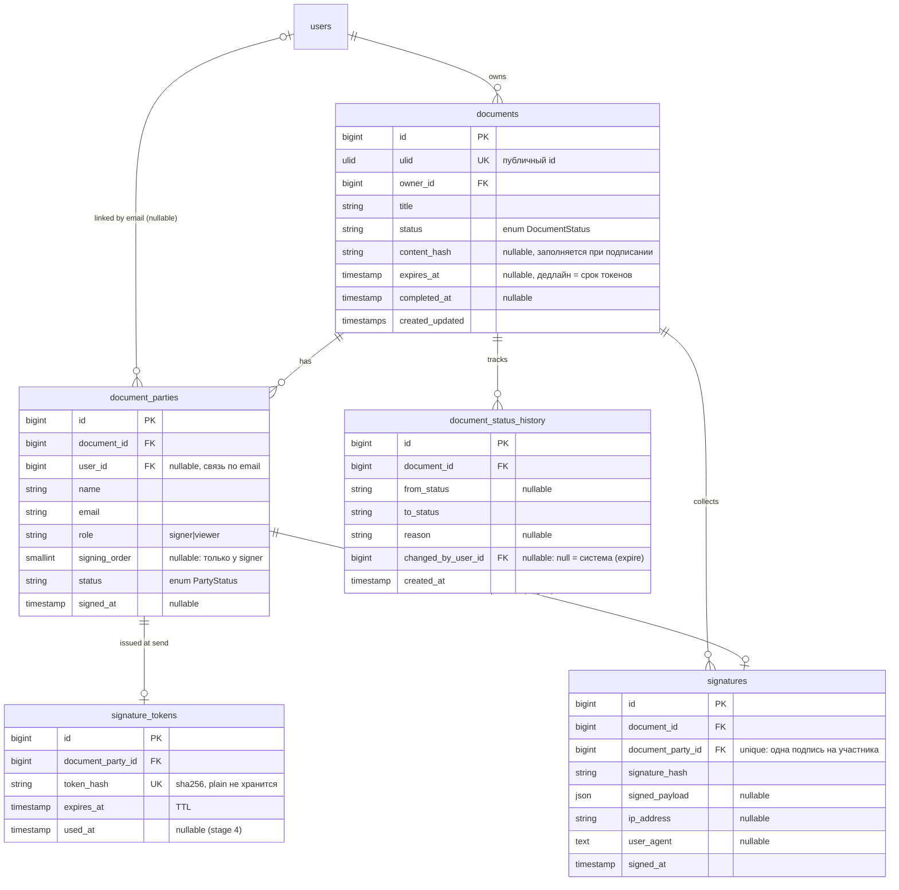
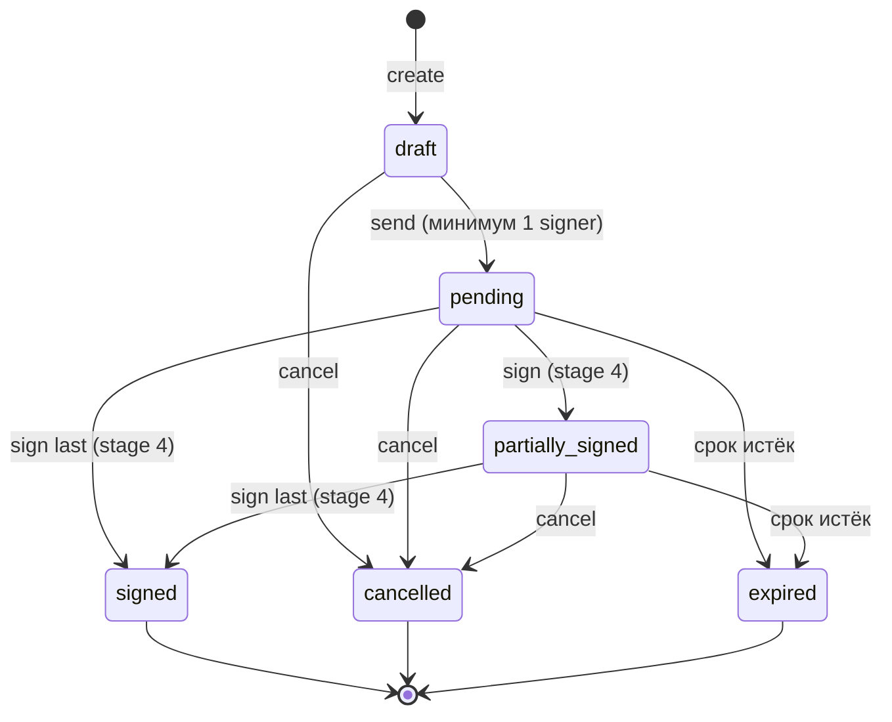
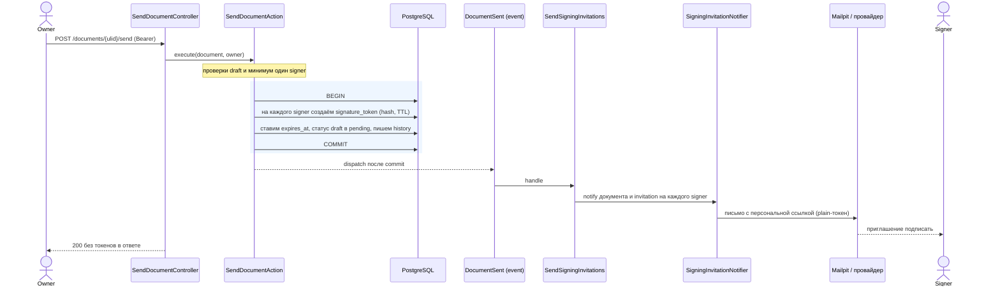
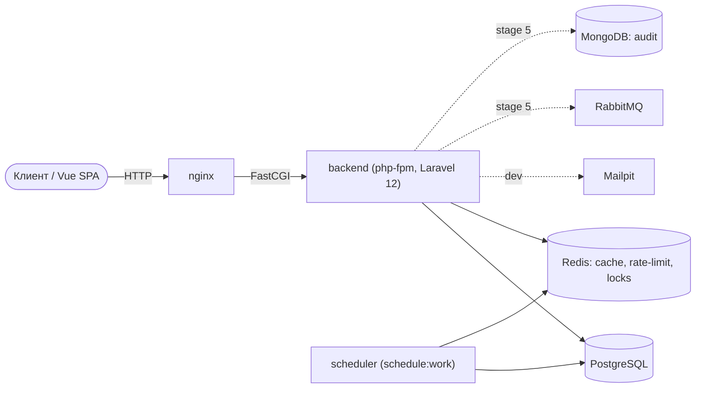
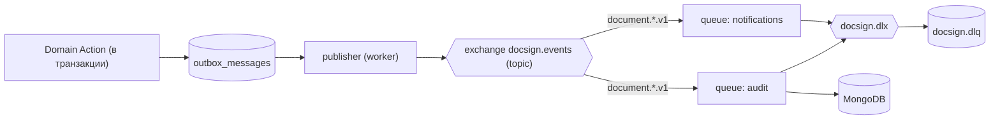

# DocSign Hub — diagrams

Mermaid-диаграммы. Рендерятся прямо на GitHub, а локально открываются как страница приложения на
`/docs/diagrams` (этот же файл, отрисованный mermaid.js — по аналогии с `/docs/api`). Держим их в
синхроне с кодом: схема БД — с миграциями, state machine — с `DocumentStatus::allowedTransitions()`,
sequence — с `SendDocumentAction` и листенерами.

## Схема данных (ERD)

Уникальные ключи: `documents.ulid`, `document_parties(document_id, email)`, `signature_tokens.token_hash`,
`signatures.document_party_id`. Составной индекс `documents(owner_id, status, created_at)` под список владельца.
Таблицы `signatures`/поле `content_hash`/`signature_tokens.used_at` — задел под подписание (Этап 4).

## Жизненный цикл документа (state machine)

Источник истины — `DocumentStatus::allowedTransitions()`; переходы пишутся в `document_status_history`.

## Отправка на подписание (sequence)

Plain-токен живёт только в памяти (`SigningInvitation`) и уходит подписанту письмом; отправителю не
возвращается. Рассылка — после commit, чтобы сбой доставки не откатывал отправку.

## Развёртывание (контейнеры)

Сплошные стрелки — текущий рантайм; пунктир — dev-почта и заготовки под Этап 5.

## События и очереди (план, Этап 5)

Транзакционный outbox → publisher → RabbitMQ topic → consumers.

