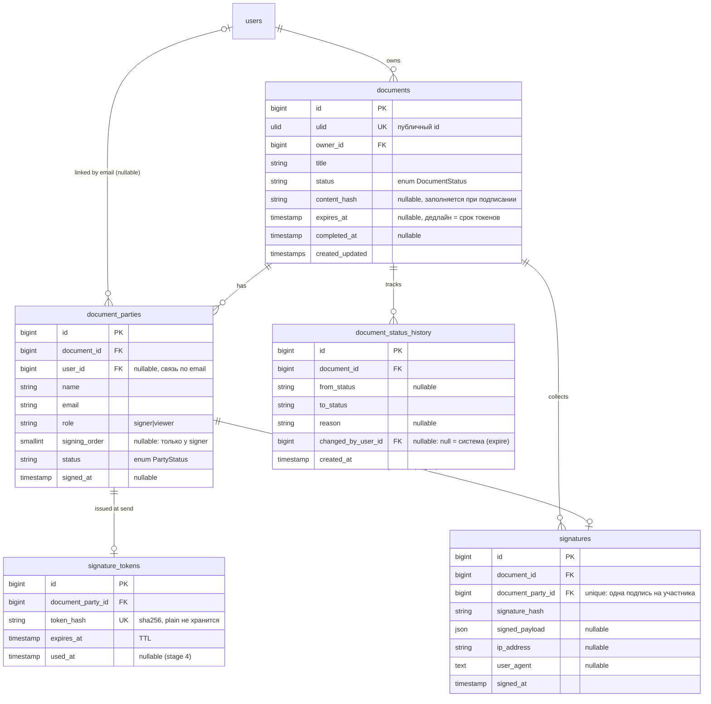
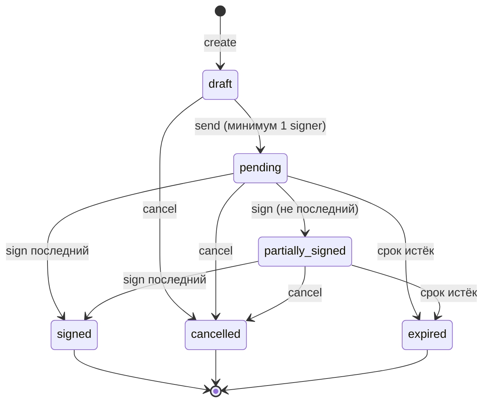
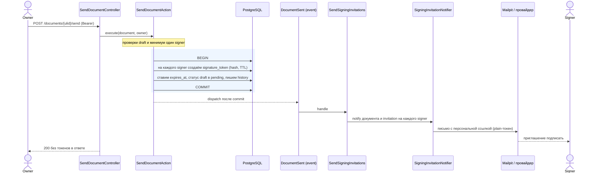
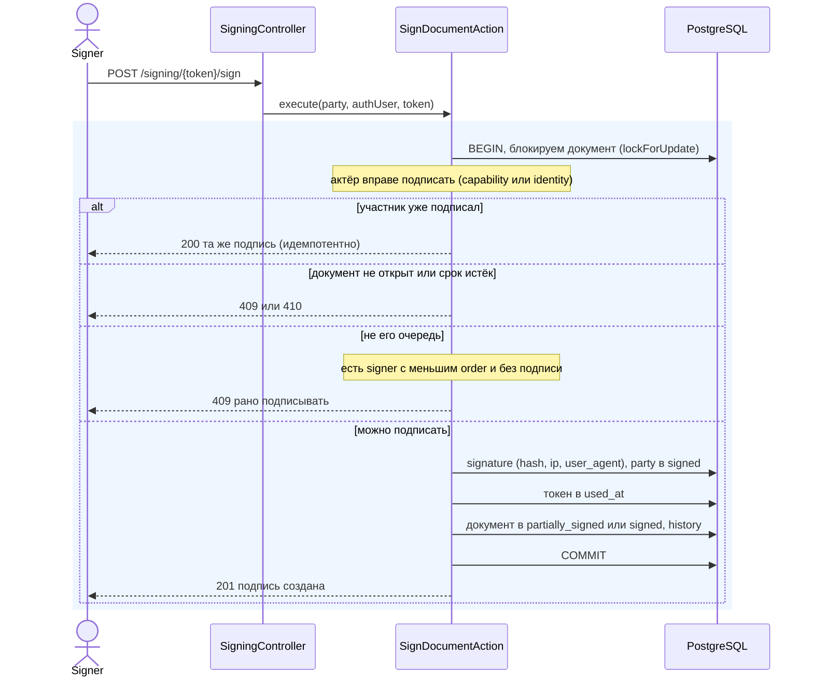
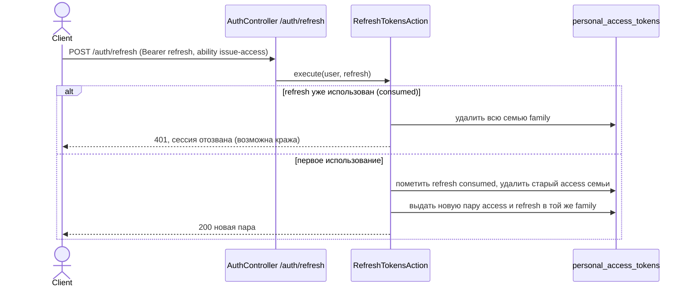
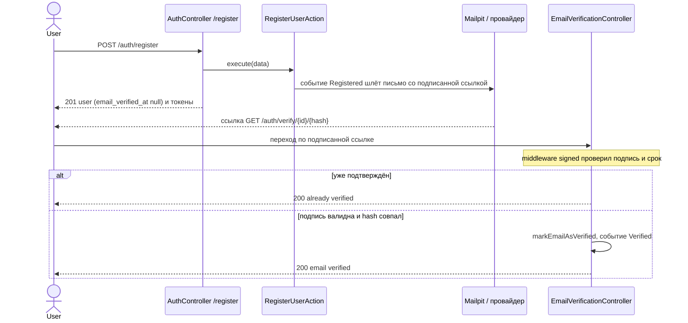
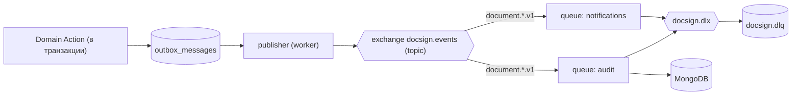

# DocSign Hub — diagrams

Mermaid-диаграммы. Рендерятся прямо на GitHub, а локально открываются как страница приложения на
`/docs/diagrams` (этот же файл, отрисованный mermaid.js — по аналогии с `/docs/api`). Держим их в
синхроне с кодом: схема БД — с миграциями, state machine — с `DocumentStatus::allowedTransitions()`,
sequence — с `SendDocumentAction` и листенерами.

Каждый раздел: сначала «что показывает», затем сама диаграмма, при необходимости — «как читать».
Содержание: [ERD](#схема-данных-erd) · [статусы документа](#жизненный-цикл-документа-state-machine) ·
[отправка на подписание](#отправка-на-подписание-sequence) · [обновление токенов](#обновление-токенов-sequence) ·
[верификация email](#верификация-email-sequence) · [развёртывание](#развёртывание-контейнеры) ·
[события и очереди](#события-и-очереди-план-этап-5).

## Схема данных (ERD)

**Что показывает:** таблицы домена и связи между ними (что на что ссылается).

**Как читать** (нотация «crow's-foot» у концов связи): `||` — ровно один, `o{` — ноль или много,
`o|` — ноль или один. Пример: «один `documents` → ноль-или-много `document_parties`». `PK` — первичный ключ,
`FK` — внешний, `UK` — уникальный. В кавычках у поля — короткий комментарий.

Уникальные ключи: `documents.ulid`, `document_parties(document_id, email)`, `signature_tokens.token_hash`,
`signatures.document_party_id`. Составной индекс `documents(owner_id, status, created_at)` под список владельца.
Таблицы `signatures`/поле `content_hash`/`signature_tokens.used_at` — задел под подписание (Этап 4).

## Жизненный цикл документа (state machine)

**Что показывает:** допустимые статусы документа и переходы между ними. `signed`/`cancelled`/`expired` —
терминальные (исходящих стрелок нет). Источник истины — `DocumentStatus::allowedTransitions()`; каждый
переход пишется в `document_status_history`.

## Отправка на подписание (sequence)

**Что показывает:** что происходит по `POST /documents/{ulid}/send` — от запроса владельца до письма
подписанту. Голубая рамка — одна транзакция БД (всё внутри либо коммитится, либо откатывается вместе).

Plain-токен живёт только в памяти (`SigningInvitation`) и уходит подписанту письмом; отправителю не
возвращается. Рассылка — после commit, чтобы сбой доставки не откатывал отправку.

## Подписание участником (sequence)

**Что показывает:** как участник подписывает (`POST /signing/{token}/sign`) строго по очереди.
Два пути идентификации: внешний — по capability-токену из письма; зарегистрированный — по своей
identity (логину). Голубая рамка — транзакция с блокировкой документа (защита от гонки параллельных
подписей). Источник истины — `SignDocumentAction`.

Account-bound участник (`user_id` задан) подписывает только как он сам: capability-токена мало, нужна
identity. Зарегистрированный может прийти из дашборда — `GET /signing-requests` и
`POST /signing-requests/{party}/sign` под `auth:sanctum`.

## Обновление токенов (sequence)

**Что показывает:** обмен refresh-токена на новую пару с ротацией и детекцией переиспользования
(`POST /auth/refresh`). Access живёт коротко, refresh — долго; оба связаны «семьёй» (`family`).
Источник истины — `RefreshTokensAction`.

Access-токен ходит в API (ability `access-api`), refresh — только на `/auth/refresh` (ability
`issue-access`); они невзаимозаменяемы. `logout` и детекция переиспользования гасят всю семью.

## Верификация email (sequence)

**Что показывает:** как подтверждается email — от регистрации до перехода по подписанной ссылке из письма.
Ссылка верификации публична: её подпись и есть capability (доказательство контроля над ящиком), поэтому
Bearer не нужен. Источник истины — `RegisterUserAction` и `EmailVerificationController`.

Создавать документы можно только с подтверждённым email (`DocumentPolicy::create`). Повторная отправка
ссылки — `POST /auth/verification/resend` под логином, с тугим `throttle:verification`.

## Развёртывание (контейнеры)

**Что показывает:** какие контейнеры есть и кто с кем общается. Сплошные стрелки — текущий рантайм,
пунктир — dev-почта и заготовки под Этап 5.

## События и очереди (план, Этап 5)

**Что показывает:** будущий путь доменного события (ещё не реализовано). Транзакционный outbox → publisher
→ RabbitMQ topic → consumers (уведомления и audit), с dead-letter очередью для разбора сбоев.

