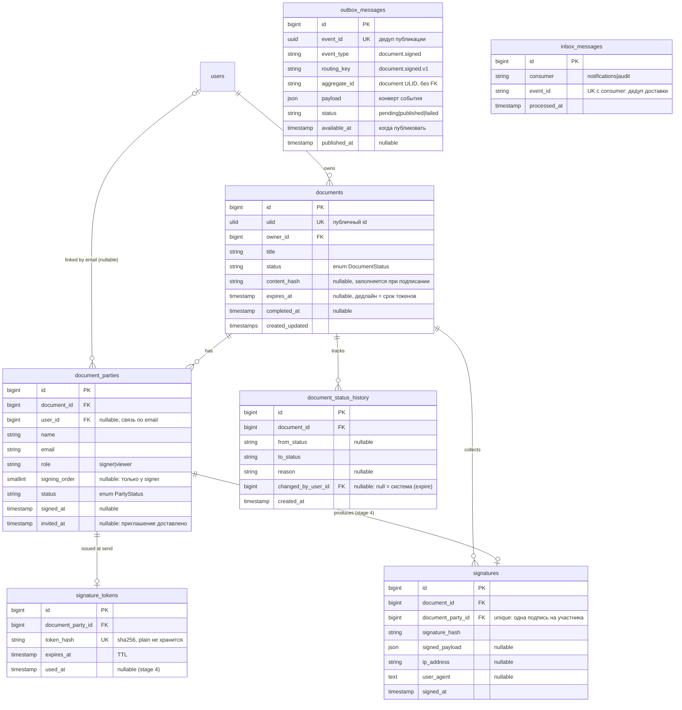
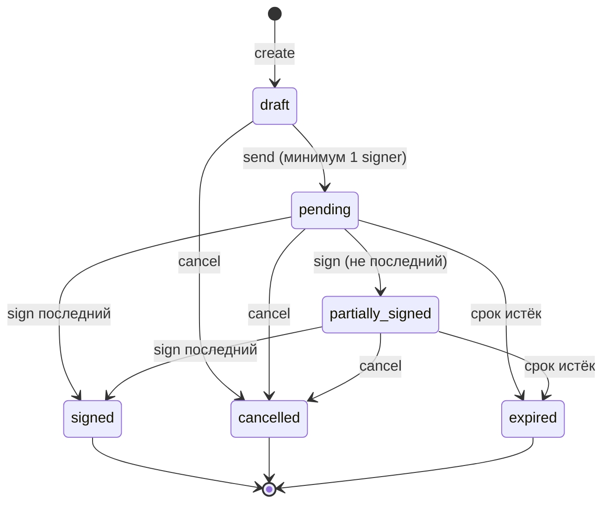
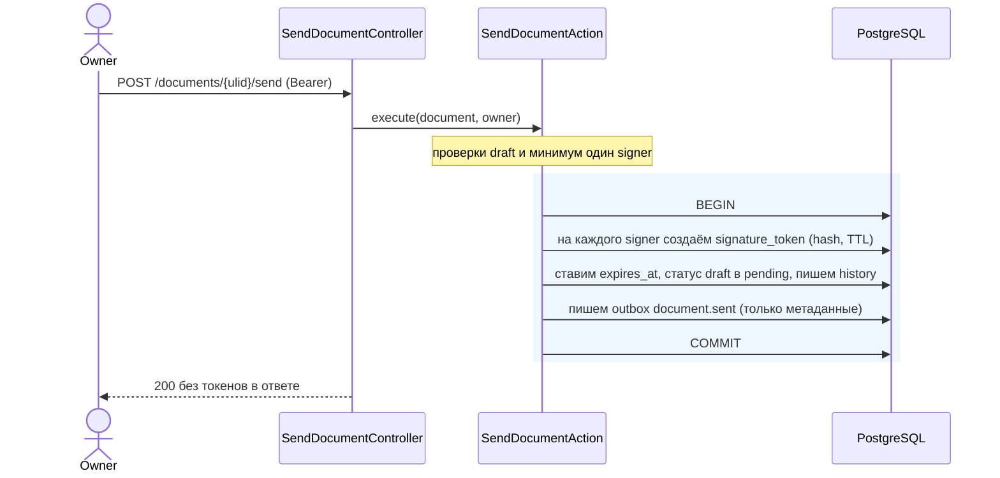
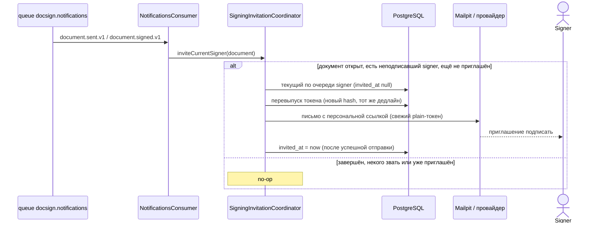
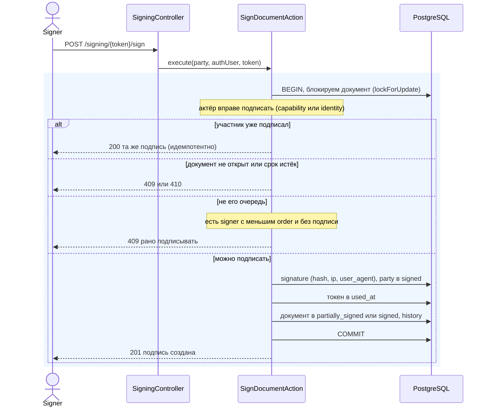
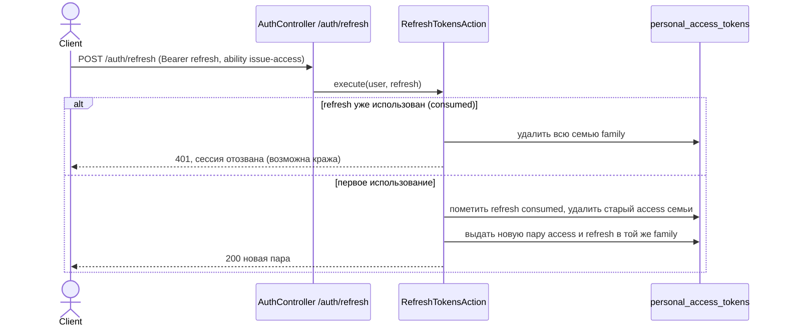
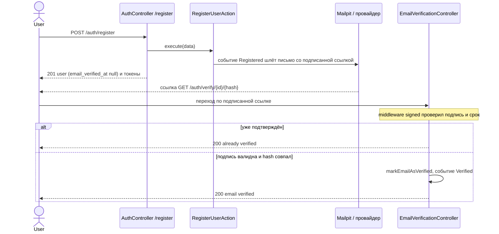
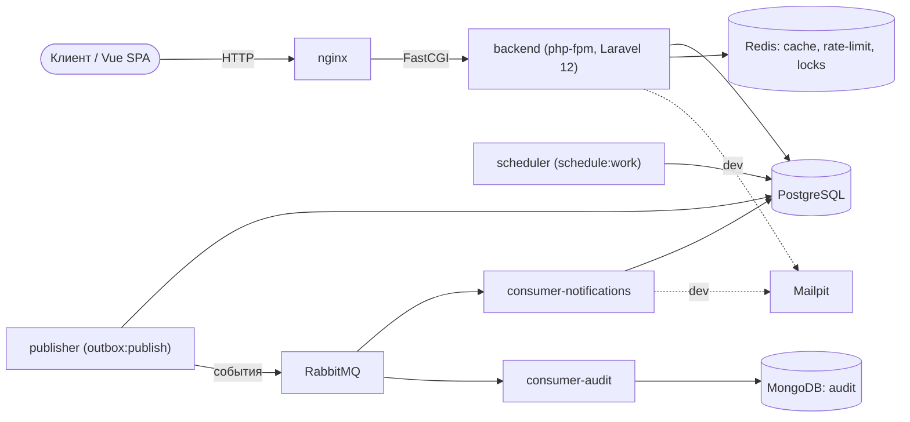
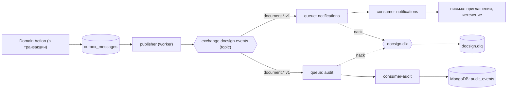

# DocSign Hub — diagrams

Mermaid-диаграммы. Рендерятся прямо на GitHub, а локально открываются как страница приложения на
`/docs/diagrams` (этот же файл, отрисованный mermaid.js — по аналогии с `/docs/api`). Держим их в
синхроне с кодом: схема БД — с миграциями, state machine — с `DocumentStatus::allowedTransitions()`,
sequence — с `SendDocumentAction`, `SignDocumentAction` и consumer'ами.

Каждый раздел: сначала «что показывает», затем сама диаграмма, при необходимости — «как читать».
Содержание: [ERD](#схема-данных-erd) · [статусы документа](#жизненный-цикл-документа-state-machine) ·
[отправка на подписание](#отправка-на-подписание-sequence) · [поэтапная рассылка приглашений](#поэтапная-рассылка-приглашений-sequence) ·
[обновление токенов](#обновление-токенов-sequence) ·
[верификация email](#верификация-email-sequence) · [развёртывание](#развёртывание-контейнеры) ·
[события и очереди](#события-и-очереди).

## Схема данных (ERD)

**Что показывает:** таблицы домена и связи между ними (что на что ссылается).

**Как читать** (нотация «crow's-foot» у концов связи): `||` — ровно один, `o{` — ноль или много,
`o|` — ноль или один. Пример: «один `documents` → ноль-или-много `document_parties`». `PK` — первичный ключ,
`FK` — внешний, `UK` — уникальный. В кавычках у поля — короткий комментарий.

Уникальные ключи: `documents.ulid`, `document_parties(document_id, email)`, `signature_tokens.token_hash`,
`signatures.document_party_id`, `outbox_messages.event_id`, `inbox_messages(consumer, event_id)`. Составной индекс
`documents(owner_id, status, created_at)` под список владельца; `outbox_messages(status, available_at)` под выборку
publisher'ом. `outbox_messages`/`inbox_messages` стоят особняком (без FK): ссылаются на документ по ULID и хранят
самодостаточный payload — так контекст обмена сообщениями не связан схемой с доменом и его можно вынести в отдельный
сервис. `inbox_messages` — идемпотентность consumer'ов: повторная доставка (at-least-once) того же `event_id` тому же
consumer'у не повторяет эффект.

## Жизненный цикл документа (state machine)

**Что показывает:** допустимые статусы документа и переходы между ними. `signed`/`cancelled`/`expired` —
терминальные (исходящих стрелок нет). Источник истины — `DocumentStatus::allowedTransitions()`; каждый
переход пишется в `document_status_history`.

## Отправка на подписание (sequence)

**Что показывает:** что происходит по `POST /documents/{ulid}/send`. Сама отправка только фиксирует
состояние и пишет событие `document.sent` в outbox; письмо подписанту уходит асинхронно — через publisher
и consumer уведомлений (см. [события и очереди](#события-и-очереди)). Голубая рамка — одна транзакция БД.

Запрос на send не блокируется почтой: доставка вынесена за очередь. Plain-токены отправителю не
возвращаются и в payload события не попадают.

## Поэтапная рассылка приглашений (sequence)

**Что показывает:** как приглашения уходят по очереди (OPEN_QUESTIONS Q3), а не всем сразу. Consumer
уведомлений на `document.sent` зовёт первого по очереди, на каждый `document.signed` (пока документ не
завершён) — следующего. Источник истины — `NotificationsConsumer` и `SigningInvitationCoordinator`.

Plain-токен не хранится, поэтому к моменту отложенной доставки его уже нет — coordinator перевыпускает
токен подписанта прямо при рассылке. Так emailed-ссылка всегда одноразовая, а в БД лежит только хеш.
Двойное приглашение исключено двумя слоями: `invited_at` на участнике (одному текущему подписанту письмо
уходит ровно раз, даже если на него указали и `sent`, и `signed`) и inbox по `event_id` (повторная доставка
того же события). Перевыпуск без `invited_at` мог бы инвалидировать уже отправленную ссылку.

## Подписание участником (sequence)

**Что показывает:** как участник подписывает (`POST /signing/{token}/sign`) строго по очереди.
Два пути идентификации: внешний — по capability-токену из письма; зарегистрированный — по своей
identity (логину). Голубая рамка — транзакция с блокировкой документа (защита от гонки параллельных
подписей). Источник истины — `SignDocumentAction`.

Account-bound участник (`user_id` задан) подписывает только как он сам: capability-токена мало, нужна
identity. Зарегистрированный может прийти из дашборда — `GET /signing-requests` и
`POST /signing-requests/{party}/sign` под `auth:sanctum`.

## Обновление токенов (sequence)

**Что показывает:** обмен refresh-токена на новую пару с ротацией и детекцией переиспользования
(`POST /auth/refresh`). Access живёт коротко, refresh — долго; оба связаны «семьёй» (`family`).
Источник истины — `RefreshTokensAction`.

Access-токен ходит в API (ability `access-api`), refresh — только на `/auth/refresh` (ability
`issue-access`); они невзаимозаменяемы. `logout` и детекция переиспользования гасят всю семью.

## Верификация email (sequence)

**Что показывает:** как подтверждается email — от регистрации до перехода по подписанной ссылке из письма.
Ссылка верификации публична: её подпись и есть capability (доказательство контроля над ящиком), поэтому
Bearer не нужен. Источник истины — `RegisterUserAction` и `EmailVerificationController`.

Создавать документы можно только с подтверждённым email (`DocumentPolicy::create`). Повторная отправка
ссылки — `POST /auth/verification/resend` под логином, с тугим `throttle:verification`.

## Развёртывание (контейнеры)

**Что показывает:** какие контейнеры есть и кто с кем общается. Сплошные стрелки — рантайм, пунктир —
dev-почта. `publisher` вычитывает outbox в брокер; два consumer'а читают из брокера: уведомления шлют письма,
audit пишет в MongoDB.

## События и очереди

**Что показывает:** полный путь доменного события. Действие в своей транзакции пишет строку в
`outbox_messages` (5a); publisher вычитывает готовые строки и публикует в topic-exchange `docsign.events`
с publisher confirms (5b); два consumer'а читают свои очереди (5c) — уведомления шлют письма, audit пишет в
MongoDB, дедуп по `event_id` (inbox). Отвергнутые (nack) уходят в dead-letter на ручной разбор. Пунктир —
путь ошибки.

